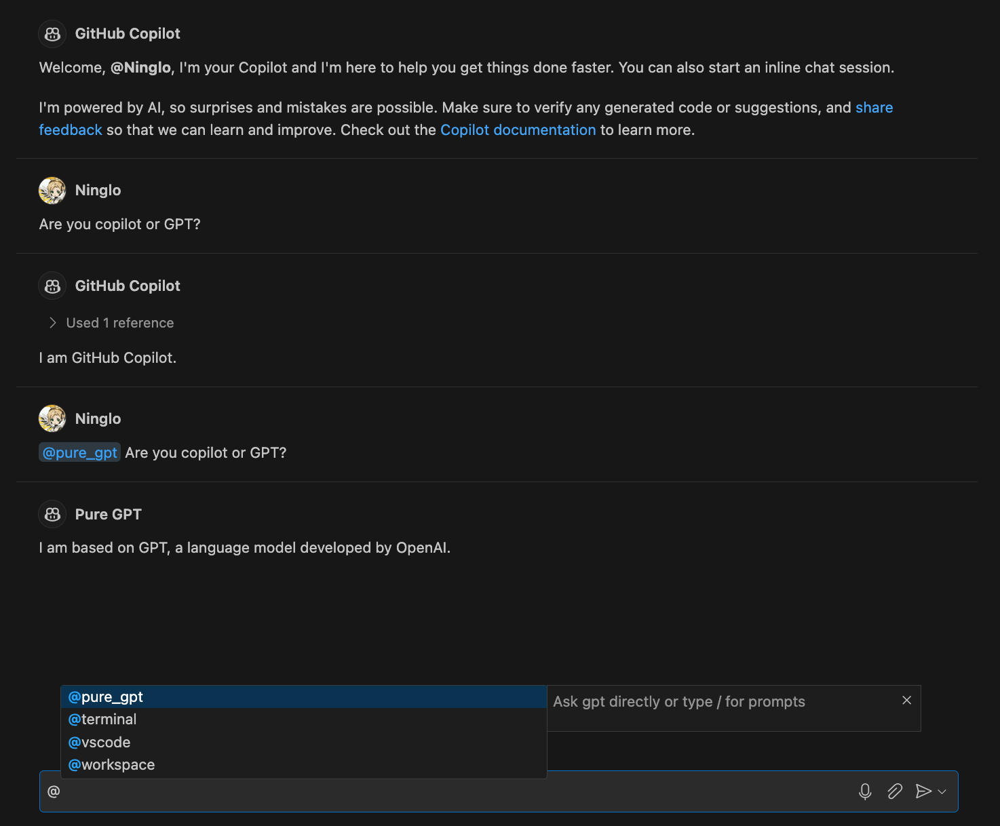
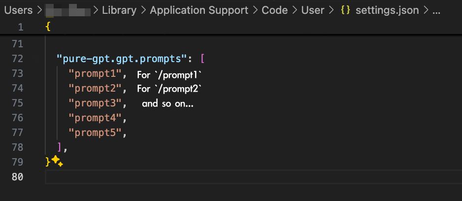
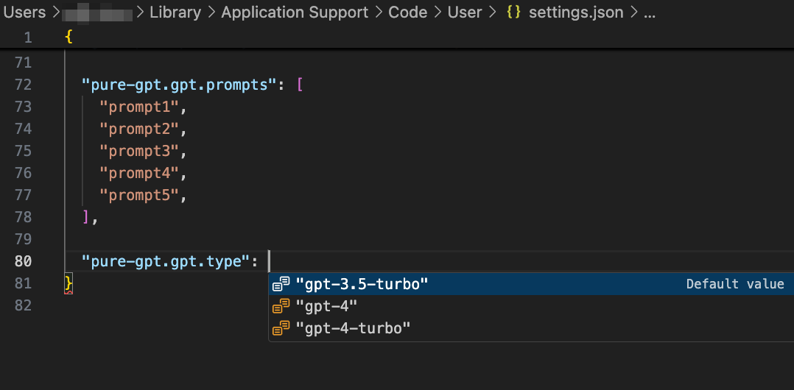

<h1 align="center">Pure GPT</h1>

English / [简体中文](./README.zh-CN.md)

Take conversation with Pure GPT instead of Copilot. Have Fun!

Use `@pure_gpt` to start a conversation with Pure GPT.

## Design Motivation

Copilot is indeed a revolutionary AI productivity tool, backed by decades of IDE development experience from the VSCode team. Its completeness of features and detailed user experience make it the leader in its niche. In my spare time coding, I've become entirely dependent on Copilot's support (Despite using Copilot in the company was locked by "The Three-Body" 😅).

However, as a deep VSCode user, I don't just use it as a code editor. Most of my notes and articles are also written on VSCode.

Although note-taking doesn't require code completion capabilities, having an intelligent AI assistant to continuously interact with and provide feedback during the writing process would be a great experience. In fact, I often switch to the chatGPT application during writing to collaboratively complete my articles. Although Copilot offers various Chat UIs (Quick Chat & Chat View) and has a good interactive experience, it is primarily trained as an agent for coding scenarios. Its capabilities in general fields are even inferior to bare chatGPT. To maximize communication quality, I still have to switch between VSCode and the chatGPT application, which obviously disrupts my flow of thought and has significant room for optimization (UI capabilities are present, but Copilot's own model capabilities fall short).

Coincidentally, VSCode recently launched APIs related to dialogues and models. With this capability, we can develop a Chat extension to customize Bots and integrate them into the native VSCode Chat UI. Even better, Copilot has already provided interfaces for several GPT models (3.5-turbo, 4, 4-turbo) in the extension API. We need to register Bot capabilities in VSCode, and then we can call bare GPT in the Chat UI.

Feedback and suggestions are welcome!

Project URL: https://github.com/Ninglo/pure-gpt

Extension Download URL: https://marketplace.visualstudio.com/items?itemName=ninglo.pure-gpt

## Notes

Note 1:
Considering the diverse scenarios for using bare GPT in communication, the extension provides the ability to customize Prompts. Add Prompts in the settings (modify the `pure-gpt.gpt.prompts` list value in the VSCode User Settings JSON) and type / in the Chat input box to select the corresponding command. The extension will insert the Prompt into the context when calling the model.

Note 2:
The extension supports changing the underlying model through configuration. Select the corresponding model in the settings (modify `pure-gpt.gpt.type` in the VSCode User Settings JSON).

Note 3:
The functionality currently relies on the Copilot extension.
