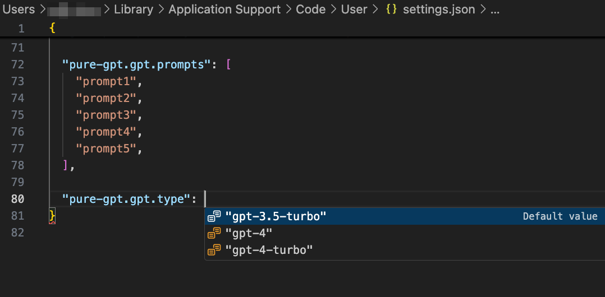

<h1 align="center">Pure GPT</h1>

[English](./README.md) / 简体中文

与纯粹的 chatGPT 对话!

使用 `@pure_gpt` 与 chatGPT 开始对话。

## 设计初衷

Copilot 确实是一款革命性的 AI 生产力工具, 背靠 VSCode 团队几十年的 IDE 研发经验, 其无论是在功能的完善程度, 还是各种细节的体验上, 都可以说做到了垂直领域中的第一. 在业余时间的编码中, 我已经彻底离不开 Copilot 对我的支持了. (公司被三体星人科技锁死暂且不论😅)

但作为一个深度 VSCode 的使用者, 我并不只把它当成一个代码编辑器使用. 我的绝大多数笔记、文章, 同样是在 VSCode 上编写完成的.

虽然说写笔记不太需要代码补全的能力, 但是如果有一个聪明的 AI 助手在写作的过程中与我持续交流, 并提供一些反馈, 那体验也会非常不错. 事实上, 我现在就经常在写作的过程中切到 chatGPT 的应用, 与其协同完成文章的编写. 虽然 Copilot 也提供了各类 Chat UI (Quick Chat & Chat View), 并且拥有良好的交互体验. 但由于 Copilot 本身是一个代码场景特化训练的 Agent, 其在通用领域的能力甚至还不如裸的 chatGPT. 为了最大化沟通的质量, 我还是得在 VSCode 和 chatGPT 应用间来回切换, 这显然是一件非常打扰思路, 而且存在极大的优化空间的待优化项 (UI 能力都具备, 只是 Copilot 自己模型能力拉了后腿).

恰巧, VSCode 最近上线了对话以及模型相关的插件 API. 借此能力, 我们就可以开发 Chat 插件自定义 Bot, 并将其插入到 VSCode 原生 Chat UI 之中. 更完美的是, Copilot 已经在插件 API 中提供了 GPT 若干模型 (3.5-turbo, 4, 4-turbo) 的接口. 我们需要编写在 VSCode 注册 Bot 能力, 就可以在 Chat UI 中调用裸 GPT 了.

欢迎提供意见和建议!

项目地址: https://github.com/Ninglo/pure-gpt
插件下载地址: https://marketplace.visualstudio.com/items?itemName=ninglo.pure-gpt

注一: 
考虑使用裸 GPT 的沟通场景非常多样化. 插件提供了定制 Prompt 的能力, 在设置 (VSCode User Settings JSON 中修改 `pure-gpt.gpt.prompts` 列表值即可) 中添加 Prompt, 并在 Chat 输入框内键入 `/` 选择相应命令, 插件就会在调用模型时将 Prompt 插进调用的上下文之中.

注二:
插件支持配置的方式修改底层调用的模型, 在设置 (VSCode User Settings JSON 中修改 `pure-gpt.gpt.type` ) 中选择对应模型即可.

注三:
功能暂时依赖 Copilot 插件.
